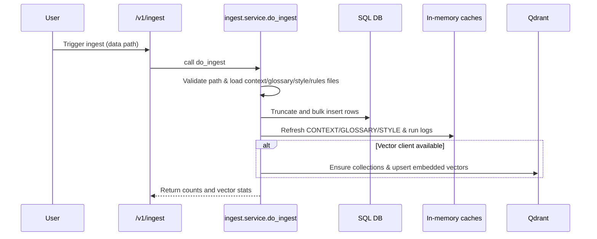
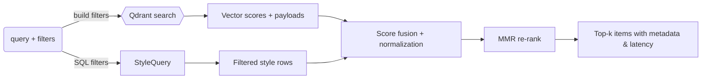
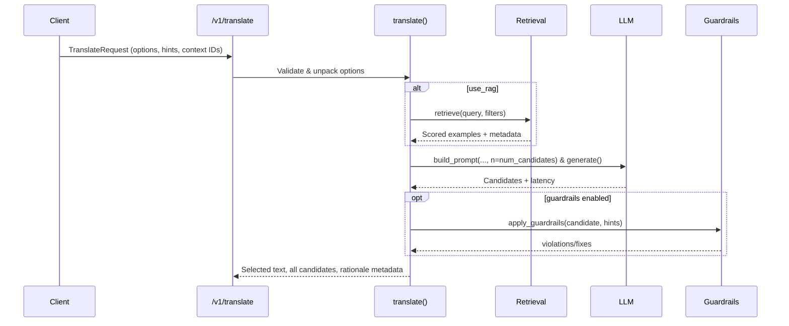

# UX Writer Assistant Architecture Guide

## System context
The lab combines a FastAPI backend, two frontend shells (Next.js for the product-like UX and a Vite test harness), and shared data/LLM services. The diagram below maps how traffic and data move between layers.

```mermaid
flowchart LR
  subgraph Clients
    FETest["Vite test UI (fe-test)"]
    NextApp["Next.js workspace (frontend)"]
  end

  subgraph Backend
    APIRouter["FastAPI app + versioned routers"]
    Services["Domain services (ingest/retrieve/translate/workflow)"]
    Middleware["Role middleware (RBAC)"]
  end

  subgraph Data
    DB[(SQLAlchemy DB)]
    Cache["In-memory caches"]
    Qdrant[(Vector store)]
  end

  subgraph LLM
    OpenAI["LLM client"]
  end

  Clients -->|HTTP (role headers)| Middleware --> APIRouter --> Services
  Services --> DB
  Services --> Cache
  Services --> Qdrant
  Services --> OpenAI
  Services -.-> Clients
```

## Backend architecture
- **FastAPI entrypoint and routing**: `app/main.py` wires CORS, the role middleware, the health probe, and all versioned routers for ingest, retrieval, translation, workflow (requests/drafts/approvals/comments), and admin utilities.【F:backend/app/main.py†L1-L29】
- **Configuration**: `app/core/settings.py` centralizes environment-driven knobs for LLMs, database URLs, and vector-store/embedding preferences, cached via `lru_cache` for reuse across services.【F:backend/app/core/settings.py†L1-L49】
- **Role enforcement**: `app/core/auth.py` attaches `X-User-Role`/`X-User-Id` to request state, exposes dependencies for role checks, and loads the current user from the DB before allowing handler execution.【F:backend/app/core/auth.py†L13-L75】
- **In-memory state**: lightweight caches hold the most recent context, glossary, style rows, and run logs for guardrail/rules reuse across translation calls.【F:backend/app/core/state.py†L1-L8】
- **Frontends**: the Next.js shell wraps all screens in `AppShell`, while nav links expose Overview, Requests, Workspace, and Exports pages for role-aware flows; the `RootLayout` sets global metadata and mounts the shell.【F:frontend/app/layout.tsx†L1-L18】【F:frontend/components/AppShell.tsx†L1-L62】

## Data flows
### Ingestion

- `do_ingest` validates the requested data path, loads JSONL/CSV/YAML assets, clears context/style/glossary tables, and bulk inserts the rows into the database.【F:backend/app/services/ingest/service.py†L121-L199】
- After database writes, the service refreshes in-memory caches and, when a Qdrant client is present, embeds rows (style/context/glossary) and upserts them into named collections with on-disk payload support.【F:backend/app/services/ingest/service.py†L25-L119】

### Retrieval

- Retrieval blends keyword matching, semantic vectors (when Qdrant is reachable), and SQL filters for device/feature/style metadata, normalizes the scores, and applies MMR diversity before returning ranked snippets plus latency and mode flags.【F:backend/app/services/retrieve/service.py†L45-L205】
- The service gracefully degrades when embeddings or vector search fail, falling back to keyword/metadata scoring so the translation pipeline still receives context.【F:backend/app/services/retrieve/service.py†L45-L99】【F:backend/app/services/retrieve/service.py†L186-L205】

### Translation

- The translation pipeline can optionally call `retrieve` with device/feature filters (or inferred request constraints) to gather RAG examples before building the prompt and setting the `n` parameter for multi-candidate generation via the singleton LLM client.【F:backend/app/services/translate/service.py†L91-L162】
- Guardrail rules come from recent run logs or database rules; the first candidate can be auto-fixed while others are checked for violations to preserve diversity, and the response carries LLM latency, retrieval trace, and guardrail selection metadata.【F:backend/app/services/translate/service.py†L176-L219】

## Technology highlights
- **FastAPI + middleware first**: simple app construction with shared role middleware and permissive CORS keeps local development friction low while enforcing header-based RBAC at every route.【F:backend/app/main.py†L1-L29】【F:backend/app/core/auth.py†L13-L75】
- **Configurable AI stack**: environment-driven settings choose LLM provider/model, embedding backend (stub vs. ONNX), precision, and Qdrant connectivity, enabling offline stubs or full vector search without code changes.【F:backend/app/core/settings.py†L15-L49】【F:backend/app/services/rag/embedding.py†L1-L114】
- **Hybrid retrieval with graceful degradation**: retrieval fuses SQL, keyword, and vector scores with configurable MMR and rerank weights while tolerating vector-store outages by short-circuiting to metadata-only scoring.【F:backend/app/services/retrieve/service.py†L19-L205】
- **Guardrail-aware translation**: translation centralizes prompt building, multi-candidate generation, optional RAG context, and rule-based fixes so UX writers can see both raw and corrected outputs alongside provenance metadata.【F:backend/app/services/translate/service.py†L91-L219】
- **Product + lab UIs**: the Next.js shell mirrors the intended product navigation and wraps all pages in a shared layout, while the Vite test UI (not shown in diagrams) offers minimal pages for quickly invoking ingest/retrieve/translate endpoints during development.【F:frontend/app/layout.tsx†L1-L18】【F:frontend/components/AppShell.tsx†L1-L62】
